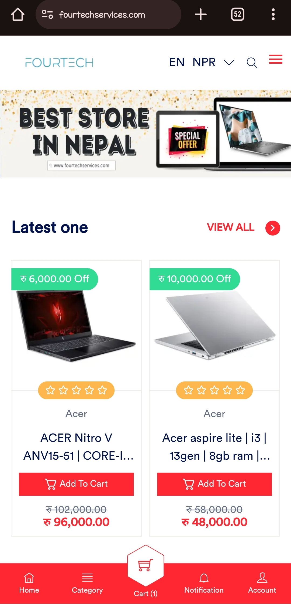
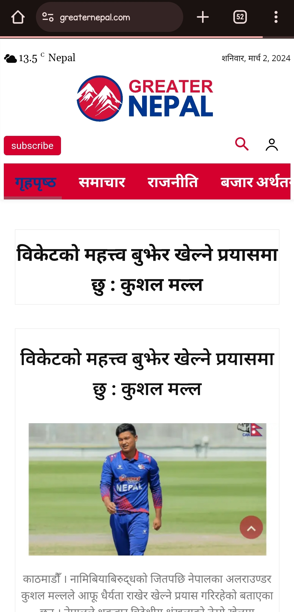

<!-- Header Section -->
<h3 align="center">
  Welcome to Yubraj Pandeya's profile!
  
</h3>

  

  
  

  

<!-- Languages and Tools Section -->
<h3 align="left">Languages and Tools:</h3>

<!-- Project Showcase Section -->
<h3 align="left">Project Showcase:</h3>

- **Fourtech Services:**

 
  
   
  Brief description goes here. Add a link to the repository and maybe a screenshot or GIF.
  [Fourtech Services](https://fourtechservices.com)

- **Greater Nepal News:**
 
  
   
  Another project description. Feel free to include any achievements or interesting facts.
  [Greater Nepal News](https://greaternepal.com)

<!-- Skills Rating Section -->
<h3 align="left">Skills:</h3>

- **JavaScript:** ⭐️⭐️⭐️⭐️⭐️
- **React:** ⭐️⭐️⭐️⭐️
- **Node.js:** ⭐️⭐️⭐️
- **MongoDB:** ⭐️⭐️⭐️⭐️

<!-- GitHub Stats Section -->
<h3 align="left">GitHub Stats:</h3>

<!-- Recent Activity Section -->
<h3 align="left">Recent Activity:</h3>

<!--START_SECTION:activity-->
<!--END_SECTION:activity-->

<!-- Blog Posts Section -->
<h3 align="left">Blog Posts:</h3>

<!-- BLOG-POST-LIST:START -->
<!-- BLOG-POST-LIST:END -->

<!-- Contact Section -->

If you wish to contact me please shoot a mail at [contact@yubrajpandeya.com.np](mailto:contact@yubrajpandeya.com.np)

